<!-- This file is auto-generated. Do not edit manually. -->
<!-- Run: python3 scripts/systems_reference.py --force -->

# length Hierarchy

**System:** HEP

**Dimension:** dim_length

```mermaid
flowchart LR
    hep_length["<b><a href="../../systems/hep/#length" style="color: var(--md-mermaid-label-fg-color); text-decoration: none;">hep::length</a></b>"]
    hep_decay_length["<b><a href="../../systems/hep/#decay_length" style="color: var(--md-mermaid-label-fg-color); text-decoration: none;">hep::decay_length</a></b>"]
    hep_length --- hep_decay_length
    hep_displacement["<b><a href="../../systems/hep/#displacement" style="color: var(--md-mermaid-label-fg-color); text-decoration: none;">hep::displacement</a></b>"]
    hep_length --- hep_displacement
    hep_position_vector["<b><a href="../../systems/hep/#position_vector" style="color: var(--md-mermaid-label-fg-color); text-decoration: none;">hep::position_vector</a></b>"]
    hep_displacement --- hep_position_vector
    hep_height["<b><a href="../../systems/hep/#height" style="color: var(--md-mermaid-label-fg-color); text-decoration: none;">hep::height</a></b>"]
    hep_length --- hep_height
    hep_impact_parameter["<b><a href="../../systems/hep/#impact_parameter" style="color: var(--md-mermaid-label-fg-color); text-decoration: none;">hep::impact_parameter</a></b>"]
    hep_length --- hep_impact_parameter
    hep_interaction_length["<b><a href="../../systems/hep/#interaction_length" style="color: var(--md-mermaid-label-fg-color); text-decoration: none;">hep::interaction_length</a> 🔒</b>"]
    hep_length --- hep_interaction_length
    hep_nuclear_interaction_length["<b><a href="../../systems/hep/#nuclear_interaction_length" style="color: var(--md-mermaid-label-fg-color); text-decoration: none;">hep::nuclear_interaction_length</a></b>"]
    hep_interaction_length --- hep_nuclear_interaction_length
    hep_mean_free_path["<b><a href="../../systems/hep/#mean_free_path" style="color: var(--md-mermaid-label-fg-color); text-decoration: none;">hep::mean_free_path</a></b>"]
    hep_length --- hep_mean_free_path
    hep_path_length["<b><a href="../../systems/hep/#path_length" style="color: var(--md-mermaid-label-fg-color); text-decoration: none;">hep::path_length</a></b>"]
    hep_length --- hep_path_length
    hep_radiation_length["<b><a href="../../systems/hep/#radiation_length" style="color: var(--md-mermaid-label-fg-color); text-decoration: none;">hep::radiation_length</a> 🔒</b>"]
    hep_length --- hep_radiation_length
    hep_radius["<b><a href="../../systems/hep/#radius" style="color: var(--md-mermaid-label-fg-color); text-decoration: none;">hep::radius</a></b>"]
    hep_length --- hep_radius
    hep_range["<b><a href="../../systems/hep/#range" style="color: var(--md-mermaid-label-fg-color); text-decoration: none;">hep::range</a></b>"]
    hep_length --- hep_range
    hep_vertex_position["<b><a href="../../systems/hep/#vertex_position" style="color: var(--md-mermaid-label-fg-color); text-decoration: none;">hep::vertex_position</a></b>"]
    hep_length --- hep_vertex_position
    hep_wavelength["<b><a href="../../systems/hep/#wavelength" style="color: var(--md-mermaid-label-fg-color); text-decoration: none;">hep::wavelength</a></b>"]
    hep_length --- hep_wavelength
    hep_width["<b><a href="../../systems/hep/#width" style="color: var(--md-mermaid-label-fg-color); text-decoration: none;">hep::width</a></b>"]
    hep_length --- hep_width
```

**Legend:**

- 🔒 indicates a root of a sub-kind - quantities that cannot be added or compared to other quantities outside their hierarchy subtree
